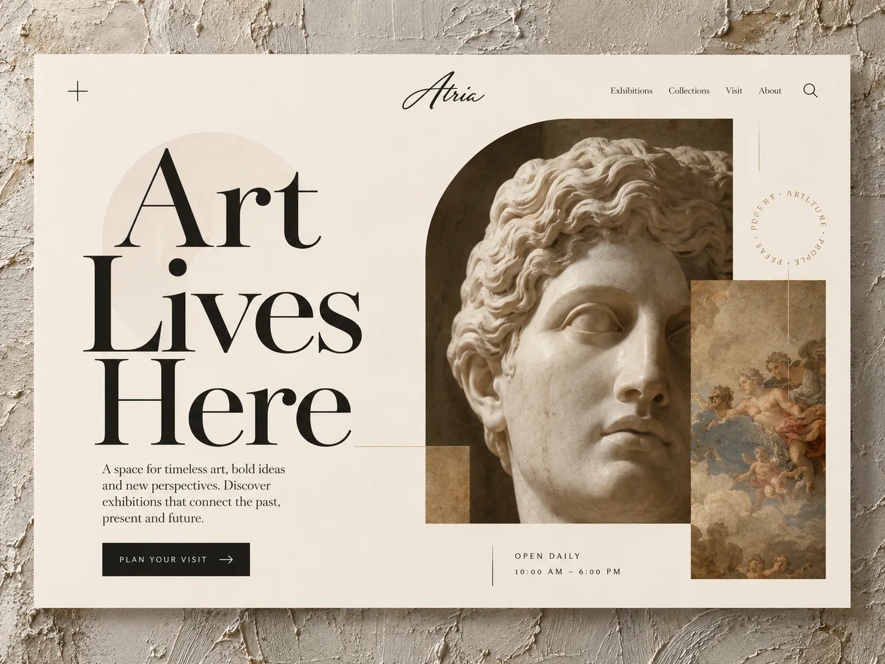
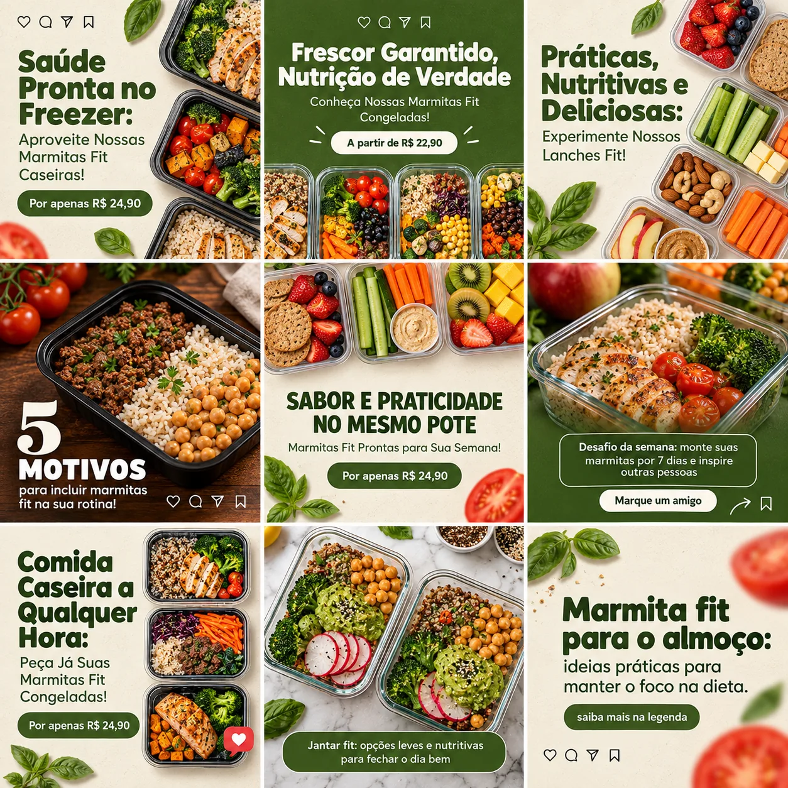
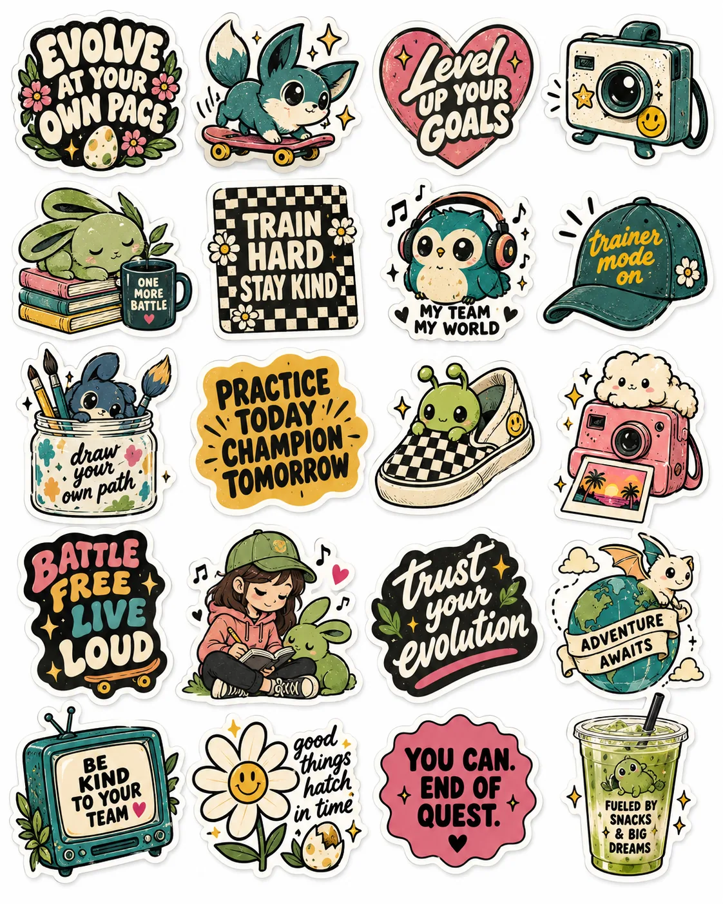
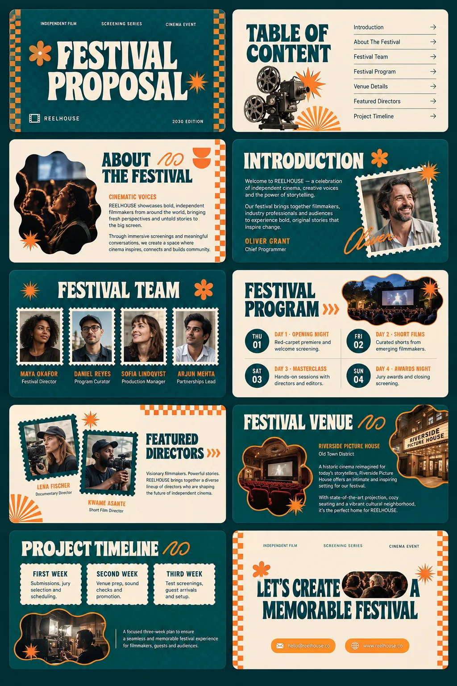
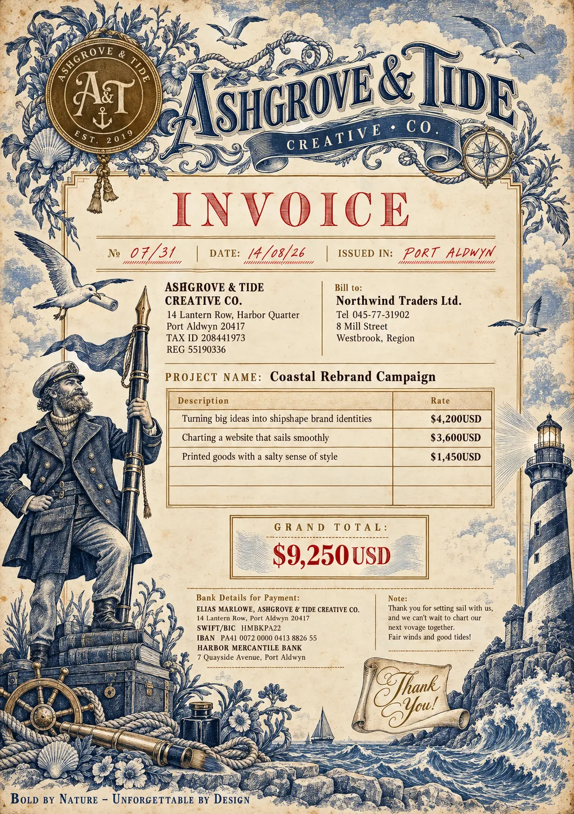
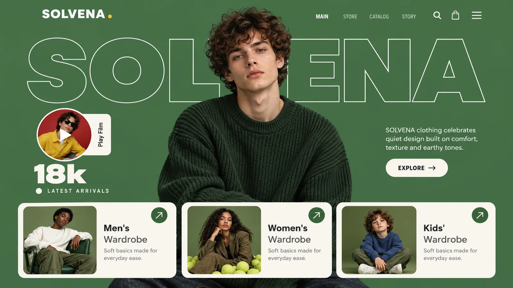
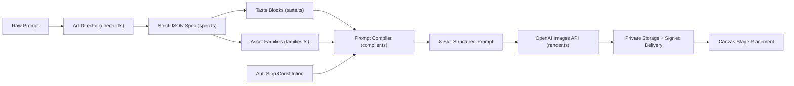

<div align="center">

# snapdesign.ai ✦

**The AI-native art direction engine and visual design studio.**

*Transform natural prompts into production-grade websites, mockups, brand assets, and marketing collateral with human-level craft and zero generic AI slop.*

<br />

[](https://nextjs.org/)
[](https://react.dev/)
[](https://www.typescriptlang.org/)
[](https://tailwindcss.com/)
[](https://supabase.com/)
[](https://openai.com/)
[](https://phosphoricons.com/)

<br />

[Features](#-key-capabilities) • [Visual Showcase](#-visual-showcase) • [The Art Director](#-the-art-director-engine) • [Canvas Studio](#-interactive-canvas-studio) • [Security & Privacy](#-enterprise-grade-security--anti-abuse) • [Quick Start](#-quick-start)

</div>

---

## 🖼️ Visual Showcase

Generated directly with the **snapdesign.ai** Art Director pipeline. No post-processing, no third-party editing tools.

<div align="center">
  <table>
    <tr>
      <td width="33%" align="center">
        
        <br />
        <sub><strong>Web Section</strong> · Editorial Asymmetry & Monospace</sub>
      </td>
      <td width="33%" align="center">
        
        <br />
        <sub><strong>Marketing Campaign</strong> · Organic Warm Palette & Macro Subject</sub>
      </td>
      <td width="33%" align="center">
        
        <br />
        <sub><strong>Graphic Design</strong> · Neo-Brutalist Sticker Sheet</sub>
      </td>
    </tr>
    <tr>
      <td width="33%" align="center">
        
        <br />
        <sub><strong>Slide Deck</strong> · High-Contrast Cinema Pitch Deck</sub>
      </td>
      <td width="33%" align="center">
        
        <br />
        <sub><strong>Document & Invoice</strong> · Archival Letterpress Texture</sub>
      </td>
      <td width="33%" align="center">
        
        <br />
        <sub><strong>E-Commerce Web</strong> · Swiss Modernist Luxury Retail</sub>
      </td>
    </tr>
  </table>
</div>

---

## ⚡ Why snapdesign.ai?

Most AI image applications are simplistic prompt-in, image-out wrappers around raw diffusion APIs. They produce the recognizable **"AI Slop" look**: random glowing geometric shapes, unreadable pseudo-text, plastic human textures, and chaotic neon gradients.

**snapdesign.ai** re-engineers this pipeline from the ground up:

| Problem with Raw Image Prompts | The snapdesign.ai Art Director Moat |
|---|---|
| ❌ Hallucinated layouts with random visual noise | ✅ **10 Structural Families**: Explicit aspect ratios, information density, and layout rules. |
| ❌ Over-saturated purple/teal gradients and plastic finish | ✅ **37+ Curated Taste Blocks**: 5 craft axes (Type, Color, Layout, Imagery, Graphic). |
| ❌ Every prompt reinvents the entire look from scratch | ✅ **Project Style Lock (`style_lock`)**: Mark an image "final" and subsequent revisions inherit the exact palette and branding. |
| ❌ Cluttered UI and unorganized image downloads | ✅ **FigJam-Style Canvas Studio**: Pan, zoom, arrange, annotate, and group visual designs on an infinite matrix. |
| ❌ Public image leaks and shared storage buckets | ✅ **Air-Gapped Privacy**: 100% private storage buckets served strictly through time-limited signed URLs. |

---

## 🧠 The Art Director Engine

The core intelligence lives in `lib/ai/studio/`. Rather than passing natural language prompts directly to an image generation model, the system executes a multi-stage compilation:



### 1. The 5 Craft Axes (`taste.ts`)
The Art Director selects human-curated design blocks across five independent aesthetic dimensions:
- **Type**: *Swiss Modernist, Brutalist Mono, Editorial Serif, Clean Geometric, Lowercase Italic Serif, Wide Display Sans...*
- **Color**: *Warm Cream & Ink, Midnight Slate, Muted Earth, Neo-Tokyo Neon, Cherry & Cream, Butter & Chocolate...*
- **Layout**: *Asymmetry Grid, Bento Box, Golden Ratio Split, Editorial Multi-Column, Magazine Hero...*
- **Imagery**: *35mm Film Snapshot, Tactile Flat Lay, 3D Clay Render, Moody Studio Portrait...*
- **Graphic**: *Brutalist Tape & Stickers, Minimalist Wireframe, Retro Risograph, Holographic Foil...*

### 2. The 10 Structural Families (`families.ts`)
Designs are strictly structured according to how humans consume the format:
`screen` (Web & Mobile) · `slide` (Presentations) · `document` (Invoices & Briefs) · `poster` (Editorial) · `social` (Campaigns) · `packaging` (Labels & Boxes) · `stationery` (Cards & Print) · `logo` (Marks & Vector Lockups) · `illustration` · `image`

### 3. The 8-Slot Prompt Compiler (`compiler.ts`)
Specifications are compiled into an 8-slot prompt structure with strict word budgets:
1. **Concept**: Core creative thesis (under 18 words).
2. **Signature Move**: One unmistakable design feature that commands attention.
3. **Typography**: Prescribed headline font classification, tracking, weight, and hierarchy.
4. **Layout**: Spatial distribution, whitespace tension, and visual hierarchy.
5. **Color & Palette**: Dominant ground, ink tone, and controlled accent placement.
6. **Subject & Imagery**: Concrete physical subjects, photographic lens, and lighting.
7. **Graphic Elements**: Intentional structural accents (hairlines, badges, minimal rules).
8. **Negative Constraints (The Anti-Slop Filter)**: Strict bans against floating geometric cubes, artificial lens flares, generic clip-art, waxy skin, and meaningless squiggles.

---

## 🎨 Interactive Canvas Studio

The workspace (`/editor`) gives designers an expansive, distraction-free environment:

- **Infinite Matrix Canvas**: Fluid pan, zoom (25% to 400%), pinch gestures, and selection handles.
- **Persistent Spatial Memory**: Card positions (`canvas_x`, `canvas_y`) and sizes (`canvas_w`) are saved to PostgreSQL on drop.
- **Context-Aware Iterations**: Selecting any image on the canvas automatically attaches it as the focal reference for your next instruction.
- **Inline Canvas Notes**: Write notes directly beneath boards (e.g. `"Homepage v2"`, `"Approved Final"`). Labeling an asset `"final"` triggers an atomic `style_lock` update for the entire project.
- **Hardware-Accelerated Cursor Comet**: Micro-interaction that brightens canvas grid dots beneath the cursor with smooth motion physics (fully disabled when `prefers-reduced-motion` is active).

---

## 🛡️ Enterprise-Grade Security & Anti-Abuse

Built to withstand production workloads with zero data leakage:

- **Server-Only Isolation (`import "server-only"`)**: Every module in `lib/` enforces server-only execution. Proprietary prompts, OpenAI API keys, and Supabase service-role credentials can never be imported into client bundles.
- **Private Buckets & Signed URLs**: Storage bucket `designs` is private. Assets are served strictly through 1-hour signed tokens. Uploads go through signed pre-allocated slots with strict MIME validation (`PNG`, `JPG`, `WebP`, `GIF`) and 10 MB caps.
- **Row Level Security (RLS)**: Public tables enforce RLS with zero public access policies. All queries are executed server-side and strictly scoped to authenticated `user_id`.
- **HMAC-SHA256 Anti-Abuse Quota (`lib/quota.ts`)**:
  - Free tier: 5 images, 25 chat turns per lifetime.
  - Quotas lock atomically in PostgreSQL (`take_free`).
  - Identifiers are irreversibly hashed using HMAC-SHA256 with `QUOTA_SECRET` across normalized email, IP subnet (`/64`), and HTTP-only cookies. No plaintext IP or email PII is stored.
- **Hardened HTTP Headers (`next.config.ts`)**:
  - HSTS (`max-age=63072000; includeSubDomains`)
  - Framing restriction: `frame-ancestors 'none'; X-Frame-Options: DENY`
  - CSP baseline: `base-uri 'self'; form-action 'self'; object-src 'none'`
  - MIME protection: `X-Content-Type-Options: nosniff`
  - Referrer security: `Referrer-Policy: strict-origin-when-cross-origin`
  - Origin isolation: `Cross-Origin-Opener-Policy: same-origin`
  - Fingerprint elimination: `poweredByHeader: false`
- **Owner Admin Portal (`/admin`)**:
  - Guarded strictly by `ADMIN_EMAILS`.
  - Non-admin visitors receive an opaque HTTP 404 (`notFound()`), concealing the portal's existence.

---

## 🛠️ Tech Stack & Architecture

```
┌────────────────────────────────────────────────────────────────────────┐
│                        Next.js 16 (App Router)                         │
├──────────────────────────────────┬─────────────────────────────────────┤
│             Frontend             │               Backend               │
│   React 19 + Tailwind CSS v4     │   Server Components + Route Handlers │
│   Newsreader + Inter Typography  │   import "server-only" Execution    │
│   Phosphor Icons (Uniform UI)    │   OpenAI Responses (Art Director)   │
│   FigJam-Style Canvas Stage      │   OpenAI Images API (Rendering)     │
└──────────────────────────────────┴─────────────────────────────────────┘
                                   │
                   ┌───────────────┴───────────────┐
                   ▼                               ▼
       ┌───────────────────────┐       ┌───────────────────────┐
       │   Supabase Postgres   │       │   Supabase Storage    │
       │   - User-Scoped RLS   │       │   - Private Bucket    │
       │   - Atomic Quotas     │       │   - Signed 1hr URLs   │
       │   - Board Coordinates │       │   - Scoped Uploads    │
       └───────────────────────┘       └───────────────────────┘
```

---

## 📁 Repository Directory Structure

```
snapdesign.ai/
├── app/                              # Next.js App Router
│   ├── (marketing)/                  # Public landing, showcase, about, legal
│   ├── (app)/                        # Authenticated workspace
│   │   ├── designs/                  # Saved projects dashboard (pin & drag reorder)
│   │   ├── editor/                   # Interactive FigJam canvas stage
│   │   └── admin/                    # Private telemetry dashboard (ADMIN_EMAILS)
│   ├── (auth)/                       # Sign-in, registration, password recovery
│   ├── api/                          # Server-only route handlers
│   │   ├── designs/                  # Design CRUD, turn handlers, canvas sync
│   │   ├── generations/              # Art director compiler & image render routes
│   │   └── usage/                    # Quota telemetry endpoints
│   ├── layout.tsx                    # Root layout with pre-hydration theme script
│   └── globals.css                   # Tailwind v4 @theme inline tokens
│
├── components/                       # UI Component Library
│   ├── auth/                         # Unified authentication forms
│   ├── brand/                        # Official SVG vectors & brand marks
│   ├── canvas/                       # Canvas stage, zoom controls, selection nodes
│   ├── editor/                       # Chat thread, generator inspector, resizers
│   └── ui/                           # High-polish design elements
│
├── lib/                              # Server-Only Core Engine ("server-only")
│   ├── ai/
│   │   ├── openai.ts                 # Configured OpenAI API client
│   │   └── studio/                   # Art Director Engine
│   │       ├── director.ts           # Structured Outputs classifier & spec maker
│   │       ├── families.ts           # 10 core asset taxonomy definitions
│   │       ├── taste.ts              # 37+ multi-axis aesthetic taste blocks
│   │       ├── compiler.ts           # 8-slot anti-slop prompt assembler
│   │       ├── constitution.ts       # Aesthetic rules & negative constraints
│   │       └── render.ts             # OpenAI Images API bridge & error handling
│   ├── db/                           # PostgreSQL queries (designs, messages, generations)
│   ├── storage/                      # Signed upload slots & 1-hour read URL manager
│   ├── supabase/                     # Service-role & browser SSR clients
│   └── quota.ts                      # HMAC-SHA256 multi-vector anti-abuse quota engine
│
├── supabase/
│   ├── migrations/                   # 11 sequential SQL schema migrations
│   └── setup-all.sql                 # Comprehensive all-in-one setup migration
│
├── documentation/                    # Living Project Memory
│   ├── architecture.md               # Detailed system architecture specs
│   ├── decisions.md                  # Comprehensive decision log (D1–D85)
│   ├── features.md                   # Feature status registry
│   └── changelog.md                  # Append-only chronological changelog
│
└── assets/                           # High-res design masters and vector sources
```

---

## 🚀 Quick Start

### Prerequisites

- **Node.js**: `v20.x` or higher
- **npm**: `v10.x` or higher
- **Supabase Account**: An active Supabase project
- **OpenAI API Key**: Account with access to Structured Outputs and Images API

### 1. Clone & Install

```bash
git clone https://github.com/the-mayankpal/snap-design-ai-.git
cd snap-design-ai-
npm install
```

### 2. Configure Environment

Copy the example environment configuration:

```bash
cp .env.example .env.local
```

Fill in your project credentials in `.env.local`:

```bash
# -----------------------------------------------------------------------------
# OpenAI Credentials (Server-Only)
# -----------------------------------------------------------------------------
OPENAI_API_KEY=sk-proj-...
OPENAI_TEXT_MODEL=gpt-4o-mini
OPENAI_IMAGE_MODEL=dall-e-3
OPENAI_TEXT_REASONING_EFFORT=low       # minimal | low | medium | high
OPENAI_IMAGE_QUALITY=standard          # standard | hd

# -----------------------------------------------------------------------------
# Supabase Configuration
# -----------------------------------------------------------------------------
NEXT_PUBLIC_SUPABASE_URL=https://your-project.supabase.co
NEXT_PUBLIC_SUPABASE_PUBLISHABLE_KEY=eyJ...
SUPABASE_SERVICE_ROLE_KEY=eyJ...       # Server-only: bypasses RLS
SUPABASE_STORAGE_BUCKET=designs

# -----------------------------------------------------------------------------
# Spend Safeguards & Metadata
# -----------------------------------------------------------------------------
ALLOW_UNAUTHENTICATED_GENERATION=true  # Set to "false" to halt all generation spend
NEXT_PUBLIC_SITE_URL=http://localhost:3000

# -----------------------------------------------------------------------------
# Quota & Admin Controls
# -----------------------------------------------------------------------------
QUOTA_SECRET=your-random-32-byte-hex-string
QUOTA_EXEMPT_EMAILS=me@example.com
ADMIN_EMAILS=me@example.com            # Grants access to /admin
```

### 3. Database & Storage Initialization

1. Open your **Supabase Dashboard** → **SQL Editor**.
2. Run `supabase/setup-all.sql` (or run migrations `000000` through `000010` in `supabase/migrations/` sequentially).
3. In **Storage**, verify that a private bucket named `designs` is created with:
   - Allowed MIME types: `image/png`, `image/jpeg`, `image/webp`, `image/gif`
   - Maximum upload size: `10MB`

### 4. Run Development Server

```bash
npm run dev
```

Visit **`http://localhost:3000`** in your browser.

---

## 📜 Development Scripts

| Command | Action |
|---|---|
| `npm run dev` | Starts local Next.js dev server with Turbopack |
| `npm run build` | Builds optimized production bundle |
| `npm start` | Runs the production build server |
| `npm run lint` | Runs ESLint analysis across all files |
| `npx tsc --noEmit` | Runs strict TypeScript type-checking |

---

## ⚖️ Engineering Constitution

This repository is governed by the principles documented in `RULEBOOK.md`:
1. **Root-Cause Engineering Only**: Symptom masking (e.g. `try/catch` wrappers without error remediation, silencing type-check errors with `any` or `@ts-ignore`, or dodging race conditions with `setTimeout`) is banned.
2. **Locked Stack Discipline**: Zero unapproved package additions. Every dependency is a permanent maintenance and security obligation.
3. **Living Documentation**: Architectural updates are logged continuously in `/documentation` on every prompt cycle.

---

## 👤 Author & Acknowledgments

- **Creator**: Mayank Pal ([@the-mayankpal](https://github.com/the-mayankpal))
- **Iconography**: [Phosphor Icons](https://phosphoricons.com)
- **Editorial Typography**: [Newsreader](https://fonts.google.com/specimen/Newsreader) & [Inter](https://fonts.google.com/specimen/Inter)
